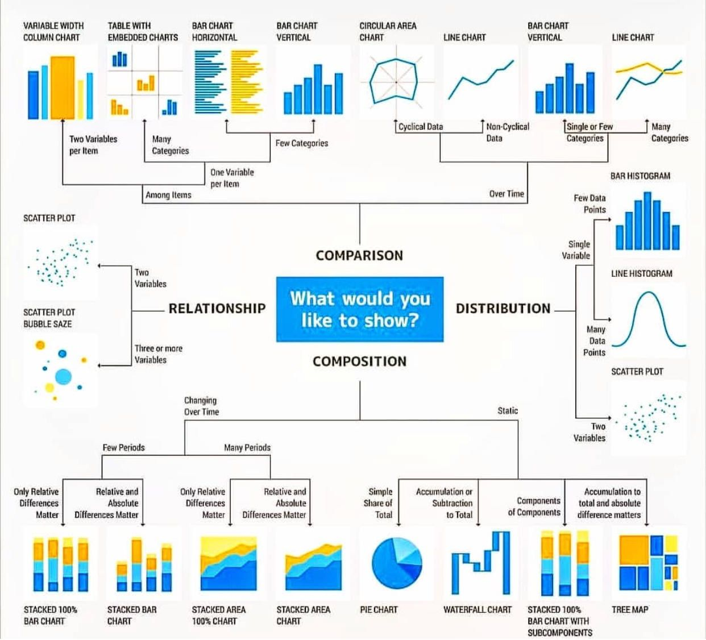
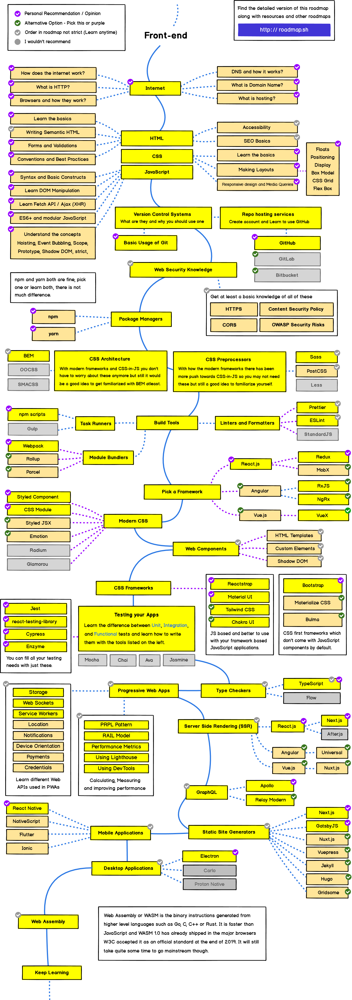

# Cheat Sheet hub

### Feel free to contribute and add any cheat sheets plus credit to source. You may correct any wrong source too.

### Data visualization cheat sheet

[Source](https://www.linkedin.com/posts/activity-6885965472618168320-gen2/)

### WebDev Roadmap (2020)

[Source](https://roadmap.sh/)

### GRE Test Prep

[Source](https://www.reddit.com/r/GRE/comments/dau3pu/gre_cheat_sheet_quants/)
